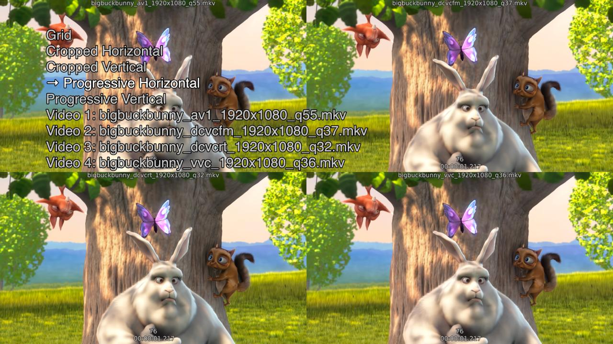

# MPV Video Comparison Tool
A small tool to make comparing different video files easier. Additionally the filename and timecode / frame are displayed.

## Usage
[MPV](https://mpv.io/) needs to be installed and be accessible my calling `mpv` in the terminal.

```
git clone https://github.com/benjaminherb/MPVComparisonTool.git
cd MPVComparisonTool
chmod +x mpvcomp
./mpvcomp v1.mp4 v2.mp4 v3.mp4 [...]
```

Alternatively install the script locally

```
chmod +x install.sh
./install.sh
```

Up to 9 videos are supported in a grid (however more can be loaded).

## Examples



